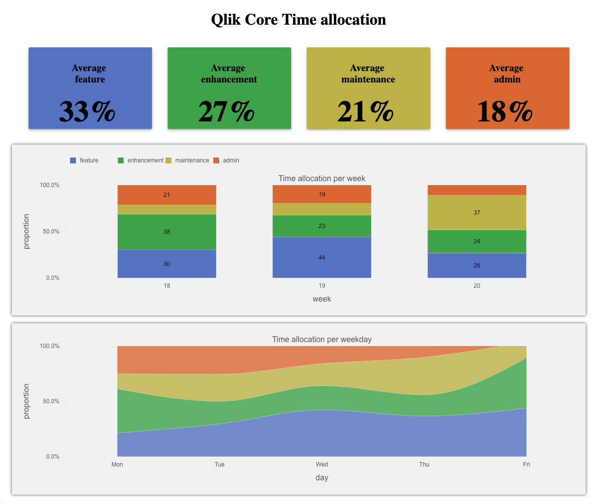

# core-time-distribution

Core time distribution is a dashboard powered by [Qlik Core](https://core.qlik.com) showing time distribution between
different development tasks (feature, enhancement, maintenance, admin).



## Usage

Note that before you deploy, you must accept the [Qlik Core EULA](https://core.qlik.com/eula/) by setting the
ACCEPT_EULA environment variable.

```bash
ACCEPT_EULA=yes docker-compose up -d
```

### Connect to Google Doc

By default the application will read from Google Spreadsheet template. To connect to your own data, copy the document
fill in your own data and share the document with view rights
[see help](https://support.google.com/drive/answer/2494822).

### Connect to local directory

If you prefer to test using a local Excel file.

* Uncomment the code snippet in [corectl.yml](corectl.yml) and comment out the the internet connection
* Uncomment the code snippet in [loadscript.qvs](./artifacts/loadscript.qvs) and comment out the existing code in
`raw_data`

### Build the Qlik Core application

When the docker container is up and running you need to build the application using
[corectl](https://github.com/qlik-oss/corectl).

```bash
corectl build
```

### Build and start the webapp

When finished, you are ready to run the react.js application:

```bash
npm install
npm start
```

## Repo architecture

```txt
Content:
/artifacts  - contains Qlik Associative Engine artifacts such as objects, measures etc
/data       - source data (the team's estimations)
/src        - react-js UI showing the dashboard
config.env  - connection config (Google Document link)
corectl.yml - corectl configuration file
```

